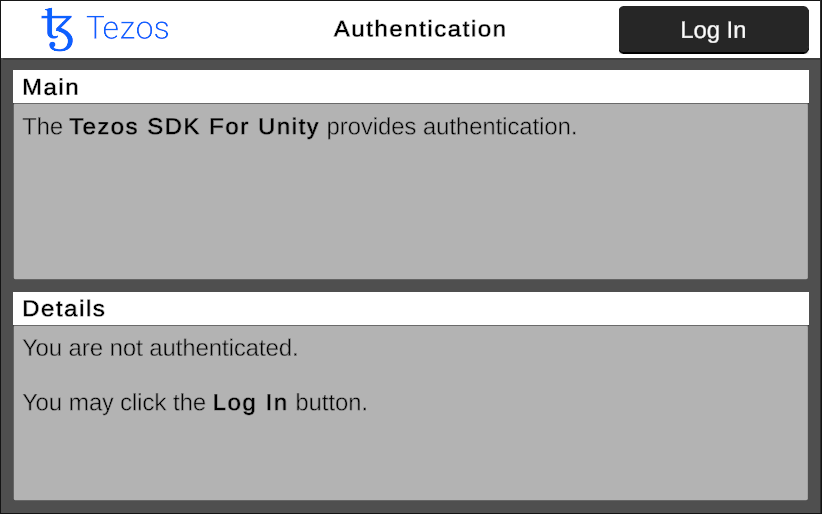
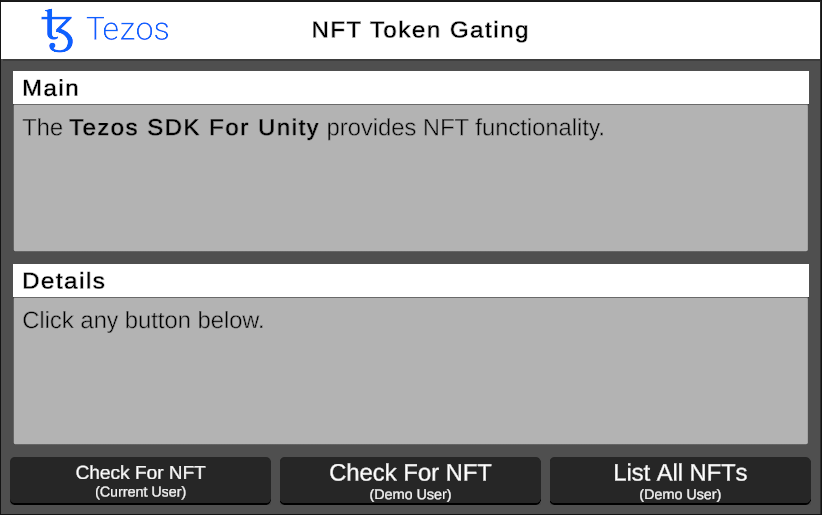

# Tezos SDK For Unity - Examples

This **Unity Project** demonstrates key features of the "Tezos SDK For Unity". It contains one isolated Unity Scene for each feature.

### Getting Started
1. Download this repo (*.zip or *.git)
1. Download the [Unity Editor](https://store.unity.com/#plans-individual)
1. Open this repo in the Unity Editor
1. Enjoy!

### Documentation
* <a href="https://opentezos.com/gaming/unity-sdk">Web Documentation</a> - **Overview** of the "Tezos SDK For Unity"


### Configuration
* **Unity Project** - <a href="./Unity/">./Unity/</a>
* **Unity Version** - [Version](./Unity/ProjectSettings/ProjectVersion.txt)
* **Unity Target** - [Standalone MAC/PC](https://support.unity.com/hc/en-us/articles/206336795-What-platforms-are-supported-by-Unity-)
* **Unity Menus** - See `Unity → Window → Tezos → Tezos SDK For Unity → Open ReadMe` for additional orientation
* **Unity Dependencies** - The [Unity Package Manager](https://docs.unity3d.com/Manual/upm-ui.html) resolves all project dependencies from the [Manifest.json](./Unity/Packages/manifest.json) including the <a href="https://github.com/trilitech/tezos-unity-sdk">Tezos SDK For Unity</a>. No further action is required


### Videos

<table>
<tr>
<th>Tezos SDK For Unity - Authentication</th>
<th>Tezos SDK For Unity - NFTS</th>
</tr>
<tr>
<td>
<a href="https://tbd/youtube/link"></a>
</td>
<td>
<a href="https://tbd/youtube/link"></a>
</td>
</tr>
</table>


### Screenshots

<table>
<tr>
<th>Example01_Authentication</th>
<th>Example02_NFTTokenGating</th>
</tr>
<tr>
<td>
<a href="./Unity/Assets/Tezos/TezosSDKExamples/Documentation/Images/Example01_Authentication.png"></a>
</td>
<td>
<a href="./Unity/Assets/Tezos/TezosSDKExamples/Documentation/Images/Example02_NFTTokenGating.png"></a>
</td>
</tr>
</table>


### Features

This project showcases several key features and use-cases for the "Tezos SDK For Unity". Here are highlights.

**Authentication**

User connects to the blockchain with a Tezos-compatible mobile wallet.

To see this feature in action, play the `Example01_Authentication` Scene. The <a href="./Unity/Assets/Tezos/TezosSDKExamples/Scripts/Runtime/Tezos/TezosSDKExamples/Scenes/Example01_Authentication.cs">Example01_Authentication.cs</a> class provides a full demonstration. Here is partial snippet.

```csharp

// Store reference for convenience
ITezosAPI tezos = TezosSingleton.Instance;

// Determines if the user is authenticated 
if (!tezos.HasActiveWalletAddress())
{
    // Makes a call to connect with a wallet
    tezos.ConnectWallet();
}
```

**NFTs**

User checks ownership of a given NFT. In production, this may unlock related game features.

To see this feature in action, play the `Example02_NFTTokenGating` Scene. The <a href="./Unity/Assets/Tezos/TezosSDKExamples/Scripts/Runtime/Tezos/TezosSDKExamples/Scenes/Example02_NFTTokenGating.cs">Example02_NFTTokenGating.cs</a> class provides a full demonstration. Here is partial snippet.

```csharp

// Setup
string demoNFTAddress = "KT1BRADdqGk2eLmMqvyWzqVmPQ1RCBCbW5dY";
int demoTokenId = 1;
            
// Store reference to Tezos SDK For Unity
ITezosAPI tezos = TezosSingleton.Instance;
        
// Returns the address of the current active wallet
string activeWalletAddress = tezos.GetActiveWalletAddress();

// Determines if the user account owns a given Nft
bool hasTheNft = await tezos.IsOwnerOfToken(
    activeWalletAddress, 
    demoNFTAddress, 
    demoTokenId);

if (hasTheNft)
{
    // Unlock special game features
}
```


